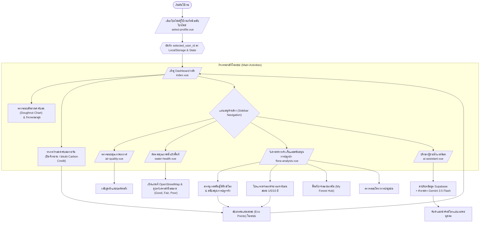

# 🌲 Eco-Sphere Tracker: User Journey Overview (ภาพรวมการเดินทางของผู้ใช้งาน)

ระบบ **Eco-Sphere Tracker** เป็นเว็บแอปพลิเคชันสำหรับติดตามและวิเคราะห์รอยเท้าคาร์บอนส่วนบุคคล (Carbon Footprint) รวมถึงการติดตามสุขภาพสิ่งแวดล้อมเชิงพื้นที่ (Air Quality & Water Health) และการสนับสนุนกิจกรรมการฟื้นฟูป่าชุมชน (Afforestation) โดยเชื่อมโยงฐานข้อมูลแบบบูรณาการร่วมกับ Supabase และประมวลผลคำแนะนำอัจฉริยะร่วมกับ Gemini AI

เอกสารฉบับนี้อธิบายถึงบทบาทผู้ใช้งาน ขั้นตอนการเดินทางในแอปพลิเคชัน (User Journey) และสถาปัตยกรรมที่ช่วยส่งเสริมพฤติกรรมการลดคาร์บอนของผู้ใช้

---

## 🗺️ แผนภาพการเดินทางของผู้ใช้งาน (User Journey Map)

---

## 👥 1. โปรไฟล์ผู้ใช้งานและบทบาท (User Personas & Profiles)

ระบบมีโปรไฟล์เริ่มต้นเพื่อจำลองการเดินทางที่แตกต่างกันตามระดับการใช้ชีวิตและการปล่อยคาร์บอนฟุตพริ้นท์ ดังนี้:

| โปรไฟล์ | พฤติกรรมการปล่อย CO₂ | คะแนนเริ่มต้น (Eco Points) | เป้าหมายในการเดินทางของผู้ใช้ |
| :--- | :--- | :--- | :--- |
| **สมชาย ดีใจ (Somchai Jaidee)** | ปานกลาง (Moderate) | 1,248 pts | ต้องการปรับเปลี่ยนพฤติกรรมในชีวิตประจำวันเพื่อลดคาร์บอนในหมวดอาหารและการเดินทาง |
| **อลิส กรีน (Alice Green)** | ต่ำ (Low) | 858 pts | รักษ์โลกอยู่แล้ว ต้องการเริ่มสนับสนุนการปลูกป่าชุมชนและศึกษาพันธุ์ไม้กักเก็บคาร์บอนสูง |
| **วิชัย นิลสุวรรณ (Wichai Nilsuwan)** | สูง (High) | 2,188 pts | มีกิจกรรมบินบ่อยและซื้อสินค้าปริมาณมาก ต้องการใช้ Carbon Credit และปั่นจักรยานเพื่อลดผลกระทบสะสม |

> [!NOTE]
> ผู้ใช้สามารถสลับโปรไฟล์เพื่อเปลี่ยนสถิติบน Dashboard ได้ตลอดเวลา ผ่านทางหน้าจอ [select-profile.vue](file:///c:/Users/Admin/OneDrive/Desktop/HK-WebAI/Hk-WebAI-Eco_Sphere_Tracker/app/pages/select-profile.vue)

---

## 🚀 2. ขั้นตอนการเดินทางโดยละเอียด (User Journey Steps)

### 📍 ขั้นตอนที่ 1: การเลือกตัวตน (Identity & Profile Selection)
1. เมื่อเริ่มเปิดแอปพลิเคชัน หากระบบไม่พบรหัสผู้ใช้ใน LocalStorage ระบบจะพาไปยังหน้า [select-profile.vue](file:///c:/Users/Admin/OneDrive/Desktop/HK-WebAI/Hk-WebAI-Eco_Sphere_Tracker/app/pages/select-profile.vue) โดยอัตโนมัติ
2. ผู้ใช้เลือกโปรไฟล์ (สมชาย, อลิส, หรือ วิชัย) เพื่อโหลดประวัติเฉพาะบุคคล
3. ระบบจะบันทึกรหัสผู้ใช้และดึงข้อมูลธุรกรรมที่เชื่อมโยงกับโปรไฟล์นั้น ๆ มาเก็บไว้ในแชร์สเตทและ Local Cache เพื่อรองรับระบบออฟไลน์

### 📍 ขั้นตอนที่ 2: การตรวจสอบสถานะคาร์บอนบนหน้าหลัก (Ecosystem Dashboard Monitoring)
ที่หน้า [index.vue](file:///c:/Users/Admin/OneDrive/Desktop/HK-WebAI/Hk-WebAI-Eco_Sphere_Tracker/app/pages/index.vue) ซึ่งเป็นศูนย์กลางควบคุม:
1. **ดูยอดรวมการปล่อย CO₂**: แสดงคาร์บอนที่ปล่อยไปแล้วในเดือนนี้ (เทียบเป้าหมาย 400 kg) และปริมาณคาร์บอนที่ช่วยลดได้
2. **วิเคราะห์สัดส่วนการปล่อย (Carbon Breakdown)**: แผนภูมิวงกลม (Doughnut Chart) แสดงสัดส่วนตามหมวดหมู่หลัก: การบิน, การเดินทาง/ที่พัก, ช้อปปิ้ง และอาหาร
3. **คำแนะนำอัจฉริยะแบบโต้ตอบได้ (Smart Recommendations)**:
   - บันทึกกิจกรรมปั่นจักรยานช่วยลดคาร์บอนทันที `-2.5 kg` (ได้รับคะแนนสิ่งแวดล้อม +100 pts)
   - ชดเชยคาร์บอนจากการบินด้วยการซื้อคาร์บอนเครดิต `-200 kg` (ได้รับคะแนนสิ่งแวดล้อม +500 pts)
4. **กิจกรรมล่าสุด (Recent Activities)**: ตารางบันทึกกิจกรรมย้อนหลัง เช่น การบินเที่ยวบินกรุงเทพฯ-เชียงใหม่, การสั่งเดลิเวอรี่, การช้อปปิ้งของออนไลน์

> [!IMPORTANT]
> สูตรการวิเคราะห์ปริมาณคาร์บอน (Carbon Sequestration Formulas) บูรณาการข้ามระบบย่อยในโครงการดังนี้:
> * **เที่ยวบิน**: 234.5 kg CO₂ ต่อเที่ยวบิน
> * **โรงแรม**: 12.0 kg CO₂ ต่อคืนที่เข้าพัก
> * **ช้อปปิ้ง**: สินค้าแฟชั่น/ไอที 15.0 kg CO₂, สินค้า Eco/รีไซเคิล 1.5 kg CO₂ ต่อชิ้น
> * **อาหาร**: อาหารเนื้อสัตว์/บุฟเฟต์ 8.0 kg CO₂, อาหารเจ/สลัด/เพื่อสุขภาพ 1.2 kg CO₂ ต่อมื้อ
> * **ธุรกรรมการเงิน**: การเดินทาง (จำนวนเงิน × 0.05), อาหาร/ช้อปปิ้ง (จำนวนเงิน × 0.01)

### 📍 ขั้นตอนที่ 3: ตรวจสอบสิ่งแวดล้อมรอบตัว (Spatial Environmental Analysis)
ผู้ใช้สามารถกดเมนูด้านข้างเพื่อสืบค้นดัชนีสุขภาพสิ่งแวดล้อมรอบข้าง:
* **Air Quality (หน้า [air-quality.vue](file:///c:/Users/Admin/OneDrive/Desktop/HK-WebAI/Hk-WebAI-Eco_Sphere_Tracker/app/pages/air-quality.vue))**:
  - แสดงค่า AQI แบบ Real-time (จำลองในพื้นที่ผู้ใช้ เช่น ดัชนี AQI 32 เป็นสีเขียวดีมาก)
  - แนะนำการทำกิจกรรมกลางแจ้งหรือการเดินทางที่ปล่อยคาร์บอนต่ำ เช่น ปั่นจักรยาน
* **Water Health (หน้า [water-health.vue](file:///c:/Users/Admin/OneDrive/Desktop/HK-WebAI/Hk-WebAI-Eco_Sphere_Tracker/app/pages/water-health.vue))**:
  - แสดงรายการพิกัดตรวจวัดคุณภาพน้ำดื่ม/น้ำอุปโภคในพื้นที่ (แบ่งกลุ่มตาม โรงพยาบาล, โรงแรม, ร้านอาหาร)
  - วิเคราะห์สารปนเปื้อน (TDS) และค่ากรด-ด่าง (pH) พร้อมผลลัพธ์: *น้ำสะอาดบริสุทธิ์ (Good)*, *เฝ้าระวัง (Fair)*, หรือ *ปนเปื้อนสูง (Poor)*
  - สามารถคลิก **"ดูแมพ & ข้อมูลเชิงลึก"** เพื่อจำลองพิกัดลงบนแผนที่ OpenStreetMap (OSM Interactivity) และเปิดดูบทวิเคราะห์การจัดการน้ำเสียเชิงลึกที่เป็นมิตรต่อสิ่งแวดล้อม

### 📍 ขั้นตอนที่ 4: การวางแผนและสนับสนุนการปลูกป่าชุมชน (Flora Afforestation Integration)
ที่หน้า [flora-analysis.vue](file:///c:/Users/Admin/OneDrive/Desktop/HK-WebAI/Hk-WebAI-Eco_Sphere_Tracker/app/pages/flora-analysis.vue) ผู้ใช้สามารถเปลี่ยนคาร์บอนสะสมให้กลายเป็นพื้นที่สีเขียว:
1. **สารานุกรมพันธุ์ไม้ (Flora Catalog)**: ค้นหาคุณสมบัติของพันธุ์ไม้ท้องถิ่นไทยที่มีอัตราการกักเก็บคาร์บอนสูง เช่น ยางนา (ดูดซับ 15 kg/ปี), โกงกางใบใหญ่ (ดูดซับ 22 kg/ปี)
2. **โปรแกรมจำลองการกักเก็บคาร์บอน (Sequestration Simulator)**: ผู้ใช้สามารถเลื่อนแถบสไลเดอร์เพื่อจำลองจำนวนต้นไม้แต่ละชนิดที่จะปลูก เพื่อคาดการณ์คาร์บอนสะสมในระยะ 1 ปี, 5 ปี และ 10 ปี พร้อมคำนวณเทียบเท่าระยะทางขับรถยนต์และหน่วยไฟฟ้าที่ประหยัดได้
3. **พื้นที่ป่าจำลองของฉัน (My Forest Hub)**: แสดงการเติบโตจำลองของต้นไม้ที่สนับสนุนแล้ว โดยจะแสดงเป็นไอคอนตามลำดับการเติบโต: *กล้าไม้ (🌱 Seedling)*, *รุ่นเยาว์ (🌿 Sapling)*, และ *โตเต็มวัย (🌳 Mature)*
4. **ลงทะเบียนสนับสนุนโครงการจริง (Community Campaigns)**: สนับสนุนการปลูกป่าจริงผ่านหน่วยงานพาร์ทเนอร์ในพื้นที่ เช่น ป่าชุมชนดอยสุเทพ (เชียงใหม่), ป่าชายเลนบางปู (สมุทรปราการ) โดยชำระเงินและรับ Eco Points สะสม

### 📍 ขั้นตอนที่ 5: การตอบคำถามและรับคำแนะนำเชิงลึก (Eco AI Assistant Consultation)
ที่หน้า [ai-assistant.vue](file:///c:/Users/Admin/OneDrive/Desktop/HK-WebAI/Hk-WebAI-Eco_Sphere_Tracker/app/pages/ai-assistant.vue):
1. ระบบจะส่งประวัติคาร์บอนสะสมและสถิติรายเดือนใน Supabase ทั้งหมดของโปรไฟล์ที่เลือกร่วมไปกับ System Prompt ของโมเดล **Gemini 3.5 Flash**
2. ผู้ใช้สามารถปรึกษา AI ผ่าน Quick Prompt (เช่น *"สรุปรายงานเดือนนี้ให้หน่อย"*, *"การซื้อของฉันสร้างคาร์บอนเท่าไหร่"*) หรือเขียนถามคำถามทั่วไปได้
3. AI จะให้คำตอบเชิงลึกที่เป็นมิตรและตรงตามกิจกรรมชีวิตจริงของผู้ใช้งานรายนั้นโดยเฉพาะ เช่น แนะนำให้ผู้ใช้ "วิชัย" ลดคาร์บอนจากการบิน หรือแนะนำให้ "สมชาย" เลือกซื้อสินค้า Eco ทดแทน

---

## 🛠️ 3. สถาปัตยกรรมทางเทคนิคที่รองรับการเดินทางของผู้ใช้ (Technical Architecture)

เพื่อส่งมอบประสบการณ์การใช้งานที่พรีเมียมและไร้รอยต่อ ระบบทำงานผ่านโครงสร้างดังนี้:

* **Nuxt 3 & Vue Components (Frontend Layer)**: 
  สถาปัตยกรรมแบบ Single Page Application (SPA) พร้อม Layout Menu ทะลุถึงกันแบบไร้รอยต่อผ่าน [default.vue](file:///c:/Users/Admin/OneDrive/Desktop/HK-WebAI/Hk-WebAI-Eco_Sphere_Tracker/app/layouts/default.vue)
* **Supabase REST API & Realtime (Data Layer)**:
  - ใช้ตาราง `users` ในการบันทึกสถานะคะแนน
  - ดึงข้อมูลจากตาราง `flight_tickets`, `hotel_bookings`, `ecommerce_orders`, `food_orders`, `transactions` และ `locations` มาประมวลผลเป็นคาร์บอนฟุตพริ้นท์ทันที
  - เปิดใช้ฟังก์ชัน Realtime Channel รับสัญญาณอัปเดตจากฐานข้อมูลทันทีที่มีการกดบันทึกกิจกรรมหรือการสนับสนุนปลูกต้นไม้
* **Gemini 3.5 Flash API (AI Layer)**:
  บูรณาการการประมวลผลภาษาธรรมชาติ (NLP) วิเคราะห์คาร์บอนส่วนบุคคลโดยมี Settings รองรับการระบุคีย์ผ่าน `.env` หรือตั้งค่าเปลี่ยนคีย์เองภายในระบบ

---

## 🛜 4. การจัดการกรณีเชื่อมต่อขัดข้อง (Offline-First Resiliency)

เพื่อป้องกันไม่ให้ผู้ใช้งานเสียจังหวะการทำกิจกรรมรักษ์โลก แอปพลิเคชันได้รับการออกแบบให้รองรับกรณีเซิร์ฟเวอร์ฐานข้อมูลหรือเครือข่ายขัดข้อง:

1. **โหมดตรวจจับออฟไลน์ (Auto-Detection)**: 
   ระบบจะตรวจสอบการเชื่อมต่ออย่างต่อเนื่อง หากตรวจพบว่าขาดการเชื่อมต่อ จะแสดงแถบแจ้งเตือนสีเหลืองด้านบนสุดของ Layout หน้าจอ
2. **ระบบดึงข้อมูลจากแคชในเครื่อง (Local Cache Fallback)**:
   - ดึงข้อมูลผู้ใช้จาก `offline_cache_users` และ `offline_cache_products` ใน LocalStorage
   - ประวัติธุรกรรมและข้อมูลพิกัดน้ำจะถูกจัดเก็บแยกตามบัญชีผู้ใช้งาน
3. **การทำงานจำลองภารกิจ**:
   - ผู้ใช้ยังสามารถกดบันทึกกิจกรรมปั่นจักรยาน หรือซื้อคาร์บอนชดเชยบนหน้าแรกได้ชั่วคราว โดยระบบจะบันทึกสถานะลงในตัวแปรแบบ Reactivity ทันที
   - แชทบอท Eco AI Assistant จะสลับโหมดแจ้งเตือนอย่างเป็นมิตรว่า "ระบบอยู่ในโหมดออฟไลน์ ไม่สามารถส่งคำถามหา AI ได้" แทนการแสดงหน้าต่างขัดข้อง (Crash)

---

## 💎 5. คุณค่าที่ผู้ใช้จะได้รับ (Value Proposition)

1. **Environmental Self-Awareness**: ช่วยให้ผู้ใช้ตระหนักรู้ถึงพฤติกรรมในชีวิตประจำวัน (เช่น สั่งเดลิเวอรี่ ปล่อยคาร์บอนสูงกว่าซื้ออาหารเจ หรือการจองโรงแรมสร้างตะกอนน้ำเสีย)
2. **Community Action & Gamification**: การปลูกป่าจำลองและการได้รับคะแนนรักษ์โลกเปลี่ยนเรื่องสิ่งแวดล้อมให้เป็นเรื่องสนุกและเข้าถึงง่ายสำหรับชุมชน
3. **Interactive Visual Insights**: การใช้แผนที่แบบโต้ตอบได้และแถบเลื่อน Simulator ทำให้เข้าใจอนาคตของระบบนิเวศโดยรอบได้อย่างเห็นภาพและเป็นรูปธรรม
